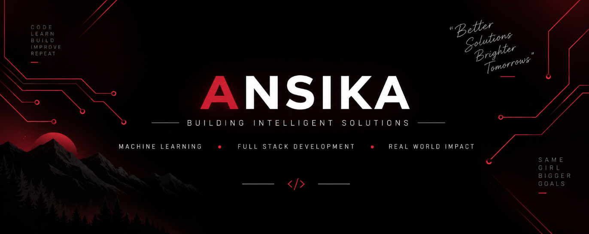

  

# Hi, I'm Ansika 👋

### B.Tech CSE @ IIITDM Jabalpur

Machine Learning Enthusiast • Full Stack Developer

Building real-world ML applications with Computer Vision, NLP, and intelligent systems.

---

## 🚀 Featured Projects

| Project | Description |
|---------|-------------|
| 🛡️ **PhishGuard** | Multimodal Phishing Detection Framework |
| 🎯 **TalentLens** | Talent Assessment Platform |

---

## 🛠 Tech Stack

### Languages

### Frontend

### Backend & Cloud

### AI / ML

---

## 📊 GitHub Activity

  

  
  

---

## 🎯 Currently Learning

- Full Stack Development
- Machine Learning
- Computer Vision
- Natural Language Processing
- System Design
- Open Source Contributions (GSoC)

---

## 📫 Connect

